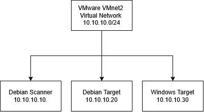

# Nmap — Week 1 Readiness Lab

## Overview

This lab introduces Nmap host discovery and service detection in an isolated VMware environment.

The purpose of the exercise is to identify active systems on an authorized subnet, compare discovery results with the known asset inventory, and perform low-intensity service detection against the lab targets.

## Lab Environment

The lab was built using VMware to create and manage the virtual machines.

- **Hypervisor:** VMware
- **Virtual Network:** VMnet2
- **Subnet:** `10.10.10.0/24`
- **Network Type:** Isolated lab network

See [Rules of Engagement](rules-of-engagement.md) for the complete authorized scope and testing limitations.

## Network Diagram

The lab topology is documented in the network diagram:



*Diagram created using diagrams.net (draw.io).*

## Asset Inventory

The known systems in the lab are documented separately in the [Asset Inventory](asset-inventory.md).

## Networking Fundamentals

### IP Addressing and CIDR

CIDR notation shows the size of a network. In `10.10.10.0/24`, the `/24` means the first 24 bits identify the network. A `/24` uses the subnet mask `255.255.255.0`.

* **Host IP** — The address assigned to a specific device or network interface, such as `10.10.10.20`.
* **Subnet** — A range of IP addresses that belong to the same network. This lab uses `10.10.10.0/24`.
* **Gateway** — Usually a router that allows devices to communicate with other networks.
* **Private IP** — An IP address used inside private networks and not directly routable on the Internet. `10.10.10.20` is a private IP.
* **Public IP** — An IP address that can be routed across the public Internet.

The lab does not use a gateway because all three VMs communicate on the same isolated subnet.

### TCP vs. UDP

**TCP** is connection-oriented and focuses on reliability. Before sending data, TCP establishes a connection using a three-way handshake (SYN, SYN-ACK, ACK). It also checks that data arrives and retransmits missing data when necessary. This added reliability creates more overhead and can make TCP slower than UDP.

**UDP** is connectionless and focuses more on speed and low overhead. It does not use a three-way handshake and does not guarantee that packets will arrive or arrive in order. This makes UDP useful when speed is more important than guaranteed delivery, such as DNS queries, streaming, and real-time communication.

## Port and Host States

Nmap can report different states depending on how a target responds to a scan.

* **Open** — A service is listening on the port.
* **Closed** — The host responded, but nothing is listening on that port.
* **Unreachable** — Nmap cannot reach the host using the attempted network path or discovery method.
* **Filtered** — The host may be reachable, but Nmap cannot determine whether a specific port is open or closed, usually because a firewall is blocking the probes.

Results can vary depending on the scan method, firewall rules, and the scanner's location on the network.

## Authorization and Written Permission

A client or prospect should not be scanned without written permission. Scanning systems without authorization can create legal and contractual risk and may also trigger security alerts or affect production systems.

Written permission establishes that the testing is authorized and defines the scope, including which systems can be scanned, what techniques are allowed, and when testing can take place. This helps protect both the client and the person performing the scan and prevents testing from extending beyond what was approved.

## Host Discovery

Nmap host discovery was first (accidentally) performed without elevated privileges:

```
nmap -sn --reason -oA results/host-discovery-unprivileged 10.10.10.0/24
```

The scan was then repeated with elevated privileges:

```
sudo nmap -sn --reason -oA results/host-discovery-privileged 10.10.10.0/24
```

The privileged scan successfully discovered the Windows target, while the unprivileged scan did not identify it during testing.

Because the targets are on the same local Ethernet network,
Nmap can use ARP-based host discovery when it has the required
privileges. This demonstrated how scan privileges and discovery
methods can affect host-discovery results.

### Options Used

* `-sn` — Performs host discovery without a port scan.
* `--reason` — Displays the reason Nmap considers a host online.
* `-oA` — Saves output in Nmap (.nmap), XML (.xml), and grepable (.gnmap) formats.
  * `.nmap` — Normal, human-readable output.
  * `.xml` — Structured XML output for use with other tools or automated processing.
  * `.gnmap` — Grepable output for command-line text processing.

### Results

The privileged scan discovered all three known lab systems:

| IP Address    | System         | Status |
| ------------- | -------------- | ------ |
| `10.10.10.10` | Debian scanner | Up     |
| `10.10.10.20` | Debian target  | Up     |
| `10.10.10.30` | Windows target | Up     |

The results matched the known asset inventory.

## Service Detection

Low-intensity service detection was performed against the discovered Debian and Windows targets:

```bash
sudo nmap -sV --version-light -oA results/service-discovery 10.10.10.20 10.10.10.30
```

The scan found open ports on the Debian target and attempted to determine the services and versions running on those ports.

The `--version-light` option reduces the number of service-detection probes Nmap sends, making it a more conservative service-discovery scan.

Service and version identification does not prove that a service is vulnerable or exploitable. It only identifies what Nmap believes is running based on responses to its probes.

### Options Used

* `-sV` — Performs service and version detection on discovered open ports.
* `--version-light` — Uses a lower-intensity set of version-detection probes.
* `-oA` — Saves output in Nmap (`.nmap`), XML (`.xml`), and grepable (`.gnmap`) formats.

### Results

The service scan produced the following results:

| Target        | Port              | State    | Service                |
| ------------- | ----------------- | -------- | ---------------------- |
| `10.10.10.20` | `22/tcp`          | Open     | OpenSSH 10.0p2         |
| `10.10.10.20` | `80/tcp`          | Open     | nginx                  |
| `10.10.10.30` | Default TCP ports | Filtered | No services identified |

The Debian target had two open TCP ports, while the remaining 998 scanned TCP ports were closed. On the Windows target, all 1,000 scanned TCP ports were filtered and did not respond to the probes.